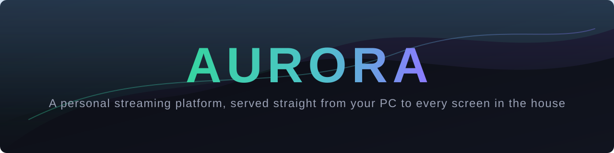
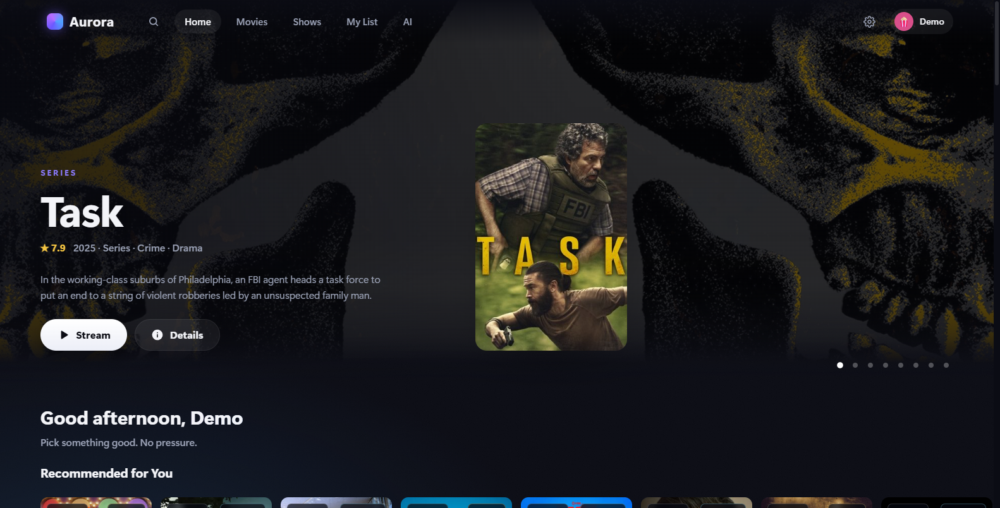
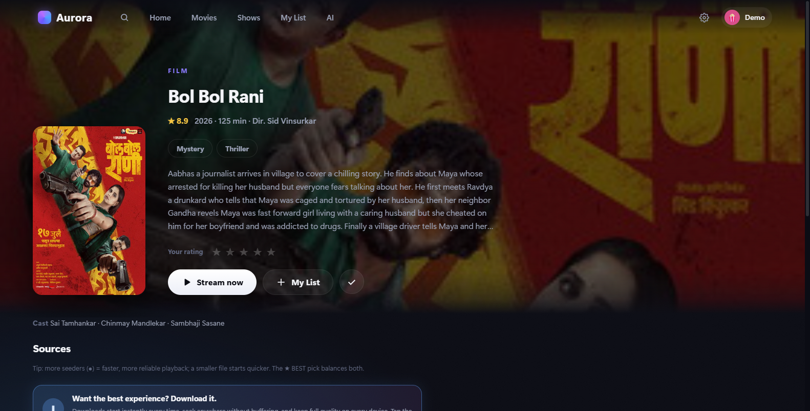
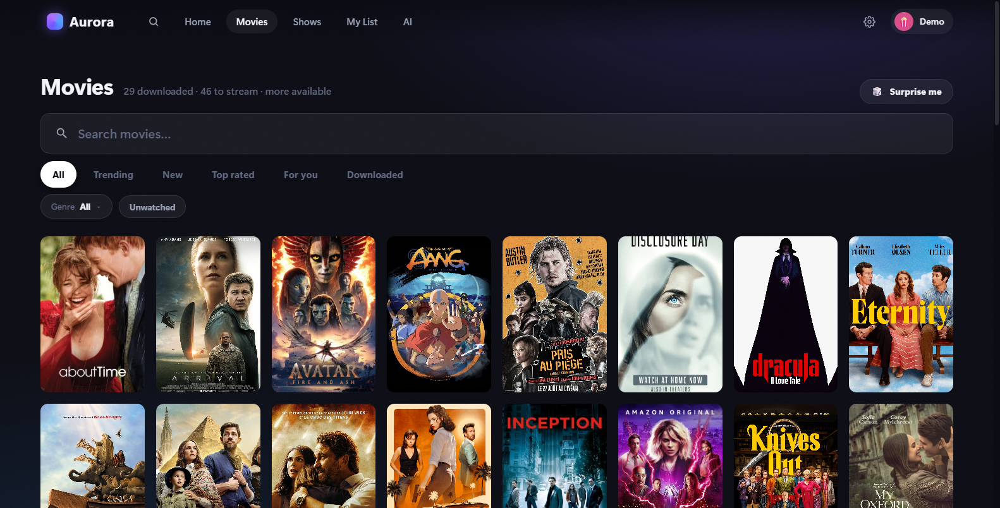
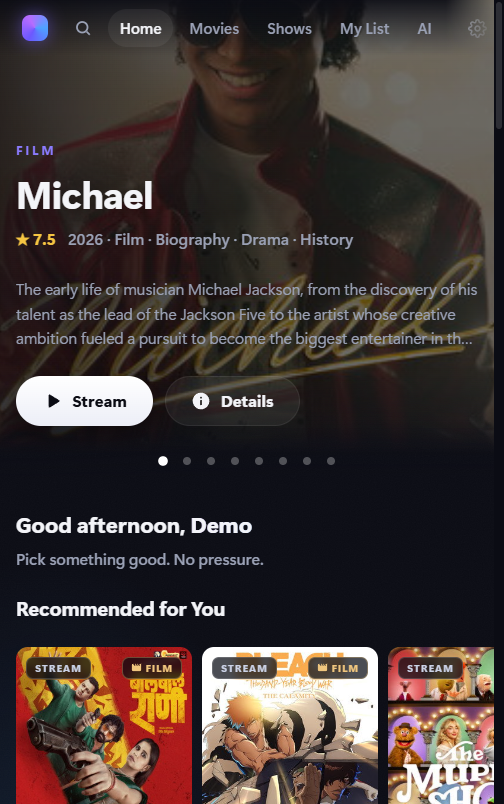
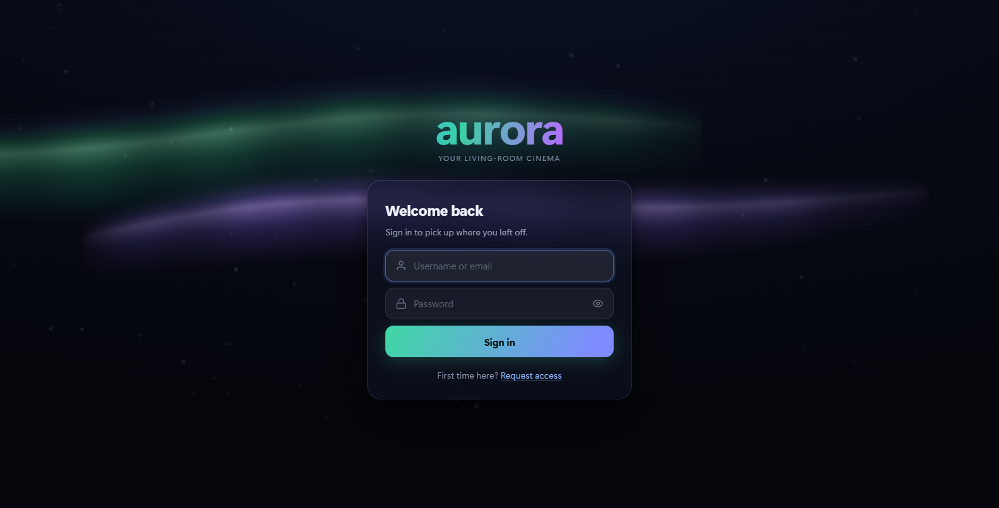

<p align="center">
  
</p>

<p align="center">
  <a href="https://github.com/nufkinaa/aurora/actions/workflows/ci.yml"></a>
  <a href="LICENSE"></a>
  
  
  <a href="CONTRIBUTING.md"></a>
</p>

**A personal streaming platform, served straight from your PC to every screen in the house.**

Aurora exists because the "family movie server" experience is usually a compromise: either a heavyweight media-center suite that needs a wiki to configure, or a bare file share that nobody's grandmother will ever navigate. Aurora is one Node process and a folder of files. It turns that folder into a Netflix-style app — rotating hero billboard, per-person profiles with watch progress, Continue Watching, real recommendations, subtitles that just work — and serves it to every browser, phone, and TV on your network. No cloud, no build step.

And when something isn't in your library, Aurora can find a source for it, stream it while it downloads, and — if you approve — file it permanently into the library, cover art and subtitles included.

> **Aurora is built for a private LAN first.** Out of the box it trusts your household the way a shared bookshelf does — and when you want more, a built-in sign-in system (username/email + password, optional Google) can be rolled out gradually from the admin panel and closed down to a real login wall. Keep the server behind your firewall; the boot banner warns you if your network address doesn't look private.

---

## Screenshots

| | |
|:---:|:---:|
|  |  |
| *Home — hero billboard, personalized rows* | *One page per title — on disk, streamable, or both* |
|  |  |
| *Browse — your library and the whole catalog together* | *Every screen works on a phone* |
|  | |
| *The sign-in screen — the aurora, painted live* | |

---

## Features

### The web app
- **Home** — rotating hero billboard, Continue Watching, Recommended, My List, New Episodes and recently-added shelves; personalized per profile, with reorderable/hideable rows
- **Real recommendations** — a per-profile taste model built from ratings, watch history and picked favorites, with "Because you loved X" rows — and every recommendation can explain *why* (hover any card)
- **Library + Discover in one** — your local files sit next to a full streaming catalog (Cinemeta/TMDB metadata); search covers both, with instant typo-tolerant autocomplete, and a downloaded+listed title is always ONE card
- **Instant torrent streaming** — pick any title, Aurora ranks the available sources (quality, seeders, CAM/dub detection, a ★ best pick) and playback starts as soon as peers are found; tuned cold-start (~4s to first frames on a healthy swarm) and real seek-readahead
- **Download to library** — a ⬇ on any source starts a server-side download (aria2) that lands in your library, with phone push notifications (ntfy) when it starts and finishes. Admin approval is only requested when the library drive is low on space
- **Player** — custom controls, scrubber with buffer display, accelerating ±10s skips, playback speed, subtitle menu, resume prompts, skip-intro marks, Up Next auto-advance for episodes; phone niceties like double-tap ±10s and safe-area layouts
- **Subtitles, seriously** — Hebrew and English from OpenSubtitles *and* Wizdom, external `.srt` (auto-converted), embedded tracks (extracted and cached), a one-command backfill tool, and automatic **OCR of bitmap-only subs** (DVD/PGS → synced `.srt`, in the background)
- **Profiles & sign-in** — per-person progress and watchlist stored server-side (resume on any device), scrypt-hashed passwords, admin approval for new profiles — and an optional full **sign-in system**: username *or email* + the profile's own password, optional Google, per-device session management, rolled out in three stages from the admin panel (see Security model)
- **Personalization** — three themes + accent colors that follow the profile to every device, custom avatar photos, a taste picker, an ambient screensaver, and **Aurora Wrapped** (your stats, all year round, with roasts)
- **TV-browser ready** — full D-pad spatial navigation, LG magic-remote pointer, Back-button handling for LG/Tizen/Android TV
- **Admin panel** (`/admin`) — live viewers, watch history and analytics, disk space and the download queue with speed caps, broadcast messages, kick/ban, profile + sign-in management, an update checker, library rescan, live log tail — all phone-friendly
- **Extras** — direct file downloads, a built-in proxy browser (`/web`) for TVs with no browser, APK hosting for the TV app

### The native Android TV app (`tv-native/`)
- The same library, Discover, sources, and profiles — rebuilt as a **real native app** for TVs where a browser is too slow
- **ExoPlayer** playback with hardware decoding (HEVC/AV1/AC-3), so the TV plays files directly — no server transcoding
- 10-foot UI with fast D-pad focus, a rotating hero, and torrent streaming with a "finding peers" flow and seek-ahead prefetch
- Finds the server even when your PC's LAN IP changes, and shows an update banner when you publish a new APK

---

## Quick start

Requirements: **Node 20+** and ideally **ffmpeg + ffprobe on PATH** (`winget install Gyan.FFmpeg` on Windows). Optional: **aria2** for download-to-library, Python 3 + Tesseract for subtitle OCR. Developed on Windows; on macOS/Linux the tool discovery in `src/config.js` already handles PATH lookups, but it sees less day-to-day testing.

```bash
git clone https://github.com/nufkinaa/aurora.git
cd aurora
npm install
cp config.example.json config.json   # then point it at your media folders
cp .env.example .env                 # then set your admin password
npm start                            # → http://localhost:4000
```

### `config.json` — server settings (gitignored)

```json
{
  "port": 4000,
  "adminName": "the admin",
  "libraries": {
    "movies": ["D:\\Media\\Movies"],
    "shows": ["D:\\Media\\Shows"]
  },
  "scanIntervalMinutes": 10,
  "autoOcrSubtitles": true,
  "downloadMinFreePercent": 10,
  "notifications": { "ntfy": { "topic": "pick-any-random-string" } }
}
```

- **libraries** — one folder per movie (`Movies/Arrival/Arrival.mp4` + optional `cover.jpg` + `.srt`); shows as `Show/Show S01E02.mp4` (season subfolders fine). Empty folders are fine to start — Discover streaming works immediately, and downloads land in the first movies folder
- **adminName** — what the UI calls you ("Every new profile needs …'s approval")
- **ntfy topic** — any random string; subscribe to it in the [ntfy](https://ntfy.sh) app for download pushes on your phone. Treat it like a password — anyone who knows it can read your notifications
- **downloadMinFreePercent** — downloads start unattended while the library drive stays at least this % free; below that they wait for admin approval (`0` = never ask)

### `.env` — secrets (gitignored)

```
AURORA_ADMIN_PASSWORD=     # required for /admin — without it the admin panel stays locked
TMDB_API_KEY=              # optional, free: age ratings + better movie search/trending
OPENROUTER_API_KEY=        # optional: enables the AI "pick for me" recommender

# Optional "Continue with Google" (see the admin panel's Sign-in rollout card):
GOOGLE_WEB_CLIENT_ID=      # a "Web application" OAuth client — the normal browser popup
GOOGLE_WEB_CLIENT_SECRET=  #   (register <your-origin>/api/auth/google/web-callback as a redirect URI)
GOOGLE_TV_CLIENT_ID=       # a "TVs and Limited Input devices" client — the code flow
GOOGLE_TV_CLIENT_SECRET=   #   (used by the TV app and devices that reach the server by raw IP)
```

Every key is optional except that `/admin` won't open without a password set. There is **no default password and no localhost bypass** — the password rides on each request and is never stored in a cookie.

Open `http://<your-pc-ip>:4000` from any device on the network. Run it permanently with `pm2 start ecosystem.config.js`, or drop a shortcut to `start-aurora.cmd` into `shell:startup` on Windows.

Without ffmpeg, playback of browser-friendly files still works, but there's no transcoding, embedded-subtitle extraction, or video stills. See [SETUP.md](SETUP.md) for operational notes and migrating between machines.

## Install the app on an Android TV

1. **Build** (or use the last published APK at `public/aurora-tv.apk`):

   ```bash
   cd tv-native
   npm install
   build-apk.bat        # builds the release APK and publishes it to public/aurora-tv.apk
   ```

2. **Sideload** one of two ways:
   - *From the TV*: install "Downloader" (or any browser) on the TV, allow unknown sources, and open `http://<your-pc-ip>:4000/download` — the APK starts downloading immediately
   - *With adb*: `adb connect <tv-ip>` then `adb install -r public/aurora-tv.apk`

3. **First run**: the app suggests the default server address — confirm or edit it, pick your profile, done.

4. **Updates**: bump `versionName` in `tv-native/android/app/build.gradle` and `APP_VERSION` in `tv-native/src/update.ts`, run `build-apk.bat`, and (optionally) publish a `public/tv-version.json` like `{ "versionName": "2.3" }` — TVs then show an "update available" banner pointing at the APK.

---

## Architecture

**Server** — plain Node + Express, four runtime dependencies, no build step. The frontend is vanilla ES modules and CSS; the TV-browser experience is a homemade spatial-navigation engine (`public/js/focus.js`) that maps D-pad input to DOM focus.

- **One detail page** (`public/js/screens/discover-detail.js`) — a title looks the same whether it's on disk, streamable, or both. Entered by library id or IMDb id, it fills in the missing half itself: the library is matched by title, and a local title's IMDb id is resolved through `/api/imdb-for` so owned titles still list other versions.
- **Library scanner** (`src/media/scanner.js`) — fast directory scan into an in-memory index, then background ffprobe enrichment (durations, resolution badges) with a disk cache. Rescans on an interval and on demand from admin.
- **Torrent streaming** (WebTorrent + Torrentio) — nothing is added to the torrent client until a player actually asks for bytes. The stream route prioritizes pieces around the playhead, so seeking into undownloaded territory triggers a prefetch region instead of a stall. Source lists are ranked server-side: quality parsing, seeder counts, CAM/dub detection, and a recommended pick. Details in [docs/TORRENTS.md](docs/TORRENTS.md).
- **Downloads** run on **aria2** (`src/media/aria2.js`), a separate process driven over JSON-RPC, so a heavy download can't touch the streaming server's event loop. Several episodes of one season pack share a single aria2 download; each job's progress is that file's exact byte count.
- **Transcoding** (`src/routes/stream.js` + ffmpeg) — files a browser can't play are transcoded on the fly; files with incompatible audio get a cheap remux instead of a full transcode. The native TV app skips all of this by hardware-decoding.
- **Subtitles** (`src/media/websubs.js` + friends) — two providers: OpenSubtitles for Hebrew and English, and **Wizdom** for Hebrew. Up to 8 tracks per language, interleaved, deduplicated by content; ZIPs and Windows-1255 handled on the way in, so what reaches a player is always UTF-8. SRT→VTT conversion, embedded-track extraction (cached), and an OCR queue (`tools/bitmap-subs-to-srt.py`) that converts bitmap subtitles to text with Tesseract. `node tools/backfill-subtitles.js` fetches sidecars for titles you added by hand.
- **Realtime hub** (`src/realtime.js`, WebSocket) — presence, watch telemetry and history, admin broadcast/kick/ban.
- **Profiles & sign-in** (`src/profiles.js` + `src/routes/auth.js`) — ACCOUNT = PROFILE: a profile carries an optional username/email/Google identity, and its one scrypt-hashed password serves both the profile lock and the login. Sessions (`src/lib/sessions.js`) store only sha256 hashes of their ids, slide over 90 days, and ride an HttpOnly cookie (browsers) or an `X-Session` header (the TV app). The rollout mode lives in `data/settings.json` and is switched live from the admin panel.

**TV app** (`tv-native/`) — React Native (the `react-native-tvos` fork, new architecture + Hermes) with `react-native-video`/ExoPlayer. Focus handling is the whole game on TV: one `Focusable` primitive drives a ring + scale on a native-driver `Animated.Value`, so a D-pad move costs zero React renders. Playback timing works around ExoPlayer's HTTP timeouts being shorter than peer discovery: the player "kicks" the server, polls readiness, and only hands ExoPlayer the URL once peers exist.

## Security model

Aurora starts as a trusted-LAN app and can be tightened, in stages, to a real login wall — the switch lives in the admin panel (Profiles → Sign-in rollout) and flips live, no restart:

- **Open** (default) — exactly the classic behavior: library browsing, streaming and download requests are unauthenticated; the network is the security boundary. The boot banner warns when your address doesn't look private.
- **Transition** — the app behaves identically, but each profile gets a one-time prompt at the wall to switch sign-in on (pick a username, optionally add an email; an existing profile password simply becomes the sign-in password). Entering a claimed profile silently signs the device in, so the household migrates just by using the app.
- **Closed** — a real login wall: every data route (`/api`, `/stream`, `/img`, `/avatars`, `/proxy`) requires a session that belongs to the profile it touches; signing in with username *or* email lands you straight in your profile. WebSocket broadcasts and telemetry writes are gated too. Health (`/api/ping`), the login endpoints, and the app shell stay reachable.

Always true, in every mode:

- **Admin is always password-gated** — every `/api/admin/*` endpoint and admin WebSocket subscription independently verifies the password from `.env`; it is compared in constant time and never persisted client-side.
- **Sessions store no usable secret** — only the sha256 of a session id is kept server-side; login attempts are rate-limited per IP and per identifier, with scrypt's cost as a second throttle.
- **The `/proxy` endpoint refuses private addresses** — it exists to browse the public web from TVs and cannot be used to reach into your LAN or the server itself.
- Everything still rides plain HTTP on a LAN (cookies are sniffable by a hostile device on your network); behind a real HTTPS domain the session cookie automatically picks up the `Secure` flag.

## Legal

Aurora is a media *player and organizer* for your own files. The torrent integration (via the public Torrentio index) is provided for retrieving content you have the right to access — public-domain and freely licensed media, or personal copies of media you own. What you stream or download with it is your responsibility, and the laws on this differ by country. The authors don't host, index, or endorse any content.

## Roadmap

The 2026 improvement roadmap — a faster torrent engine, typo-tolerant search, server-cached artwork, mobile QoL, personalization, real recommendations, and the sign-in system — has **shipped**. What's next, roughly in order:

- **TV app sign-in** — the native app learns the new login (the server side is ready and waiting)
- **Kids profiles** — content limits per profile, now that sign-in exists to anchor them
- **Letterboxd import** — waiting on API access

Ideas and votes welcome in [issues](https://github.com/nufkinaa/aurora/issues).

## Contributing

Small codebase, no build step, four dependencies — easy to dive into. Start
with [CONTRIBUTING.md](CONTRIBUTING.md); bug reports with reproduction steps
are as valuable as patches. Security reports go through
[SECURITY.md](SECURITY.md), and everyone here follows the
[code of conduct](CODE_OF_CONDUCT.md).

## Development

```bash
npm test          # ~250 unit tests, no network, a few seconds
```

Repo layout:

```
server.js              boot + wiring (+ the closed-mode route gate)
config.example.json    copy to config.json: port, folders, notifications
.env.example           copy to .env: admin password + API keys
src/
  media/               scanner, metadata, subtitles, OCR, downloads, torrents, taste model
  routes/              api, stream, profiles, auth, admin, torrent, downloads, proxy
  profiles.js          profiles / sign-in identity / progress / watchlists
  realtime.js          WebSocket hub: presence, history, notifications
  lib/sessions.js      sign-in sessions (hashed ids, sliding expiry)
public/                web app (vanilla ES modules, no build step)
  js/screens/          one screen per route (discover-detail.js is THE detail page)
  aurora-tv.apk        published Android TV build
tv-native/             native Android TV app (react-native-tvos)
tools/                 subtitle backfill, OCR pipeline, webtorrent patch
test/                  node:test suites
data/                  caches + JSON stores (gitignored)
```

If you're setting up your own instance and something in these docs doesn't survive contact with reality, that's a bug too — open an issue.

## License

[MIT](LICENSE)
