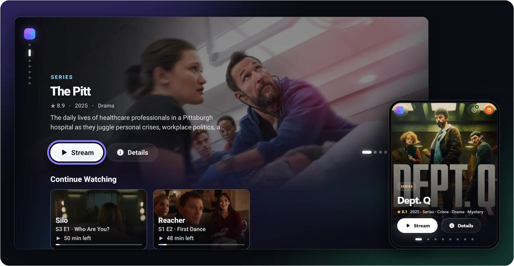
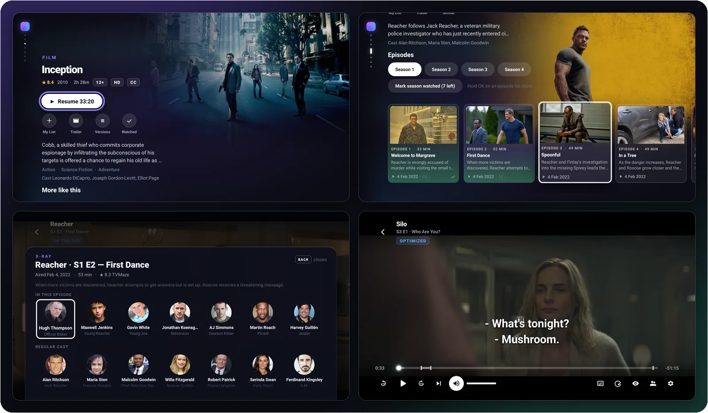
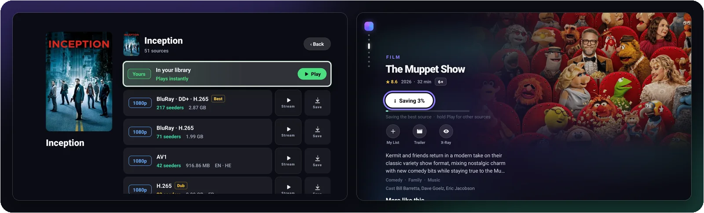
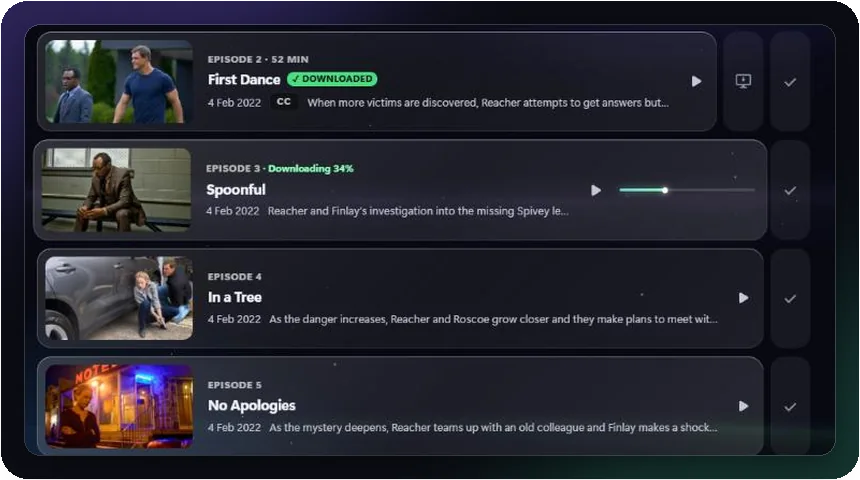
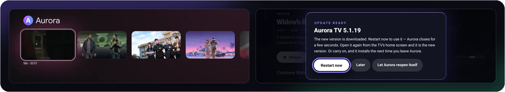
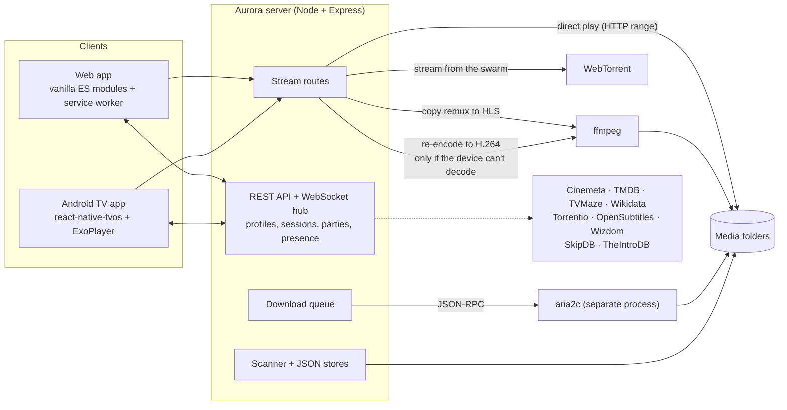

<h1 align="center">Aurora</h1>

<p align="center">
  <b>A private streaming service for one household.</b><br>
  One Node process turns your media folders — and any title you can find a source for — into a Netflix-style app<br>
  for every browser, phone and Android TV in the house.
</p>

<p align="center">
  <a href="https://github.com/nufkinaa/aurora/actions/workflows/ci.yml"></a>
  <a href="LICENSE"></a>
  
  
</p>

<p align="center">
  
</p>

Aurora is a server you run on a PC at home, a web app with no build step (installable to a phone's Home Screen), and a native Android TV app. It plays the files you own exactly as they are, finds and streams what you don't own, and — when you press Play on something missing — downloads the best copy into the library for everyone.

It is built for one family, not for scale, and it is opinionated about that: profiles instead of accounts, an admin who approves newcomers, and a server that looks after itself.

**Contents** — [What it does](#what-it-does) · [Quick start](#quick-start) · [Configuration](#configuration-reference) · [The TV app](#the-android-tv-app) · [Deploying](#deploying) · [Architecture](#architecture) · [Development](#development) · [Status & limits](#status--limits)

---

## What it does

### ▶ Watch

- **The file, bit for bit.** "Original" quality is the file's own video, copied and never re-encoded, on every device that can decode it: direct play for MP4/H.264, an HLS copy-remux for MKV and HEVC. Only a device that cannot decode the codec gets an H.264 re-encode — and the Quality menu says so.
- **A line that can't keep up is handled for you.** Each device measures its connection; a slow one starts library titles at 720p or 480p, steps down before the picture freezes and climbs back when there is room. Data saver and Full quality are a setting away.
- **Skip intro, Skip recap, and Up next at the real credits.** Timestamps come from chapter markers, then from Aurora's own audio fingerprinting across a season, then from two public crowd-sourced databases (SkipDB, TheIntroDB), re-asked daily. A **Next episode** button sits in the player from the first second.
- **X-Ray.** Who is in this, who made it, what people thought — per title and per *episode* (guest cast first, then the regulars), on a title's page or as a sheet over the paused film.
- **Subtitles that just work.** Embedded tracks, sidecar `.srt`/`.vtt`, automatic fetch in your profile's language (Hebrew, English, Russian) from OpenSubtitles and Wizdom, OCR of image-only subtitles into text, and a timing nudge in the player.
- **Audio tracks.** A multi-dub file starts on the title's original language; the player lists every track and switches at the same second.
- **Lock-screen and headset controls, picture in picture, resume four seconds early**, and audio/subtitle choices that follow your profile to every device.
- **Watch together.** Start a party from the player, share a four-letter code; play, pause, seek and Up next stay in step across phones, browsers and TVs.

<p align="center">
  <br>
  <sub>The TV app: a film's page · episodes (green = on disk, purple = up next) · X-Ray for one episode · the player</sub>
</p>

### 🔎 Find

- **Library and catalogue are one place.** Your files sit beside a full catalogue (Cinemeta, upgraded by TMDB when you add a key); a title is always one card and one page, whether it is on disk, streamable, or both.
- **Search** is typo-tolerant with instant suggestions, and shows what the house has been watching when the box is empty.
- **Recommendations with a reason.** A per-profile taste model built from ratings, history and picked favourites; "More like this" ranks by shared themes rather than popularity; an optional AI picker answers "describe the mood" (needs an OpenRouter key).
- **A hero that moves.** After a few seconds the billboard cross-fades into the title's trailer, in 1080p where the device and line can carry it.

### ⬇ Download

- **Press Play to save the best source.** For a film or episode the library lacks, one press picks the server's best source (recommended, else best-seeded) and downloads it into the library; the button or episode card carries the progress and turns into Play when it lands. A hold opens the full list of sources, where you can also stream straight from the swarm.
- **Smart downloads.** Two-thirds into an episode the next one starts downloading, and episodes fetched this way are tidied up once you have moved on.
- **Follow a show.** New episodes download by themselves when they air (checked every three hours).
- **Told when it's ready.** Web Push reaches a phone with Aurora closed — signed by your own server, no third-party push service or extra dependency. The admin can also get ntfy or Telegram messages.
- **Offline on a device.** Save a title into the browser's own storage at Original, 1080p, 720p or 480p; skip-intro marks, X-Ray and resume travel with the copy. Needs HTTPS (see [Deploying](#deploying)).
- **Disk-aware.** Downloads start unattended until the library drive drops under a free-space threshold, then wait for the admin; the admin panel suggests what to delete when space runs low.

<p align="center">
  <br>
  <sub>Sources in plain words, your own copy first · a film being saved, progress on the Play button</sub>
</p>

<p align="center">
  <br>
  <sub>The same flow on the site: an episode card carries its own download</sub>
</p>

### 👪 Household

- **Profiles.** Per-person progress, My List, ratings, taste, look and languages, stored on the server so everything resumes on any device. New profiles are requested at the door and approved by the admin.
- **Sign-in when you want it.** Starts as a trusted-LAN app and can be tightened in three stages from the admin panel, live: *Open* → *Transition* (each profile is invited to pick a username; nothing breaks) → *Closed* (a real login wall on every data route). Username or email + password, optional Google, a QR/code flow for TVs, a list of signed-in devices and "sign out everywhere else".
- **Admin panel** (`/admin`, phone-friendly): what needs you, in sentences; who is connected right now; a People table with a sheet per person (devices, downloads, kick, suspend, forced password reset, ban); the download queue with speed caps and storage; insights and usage stats; a health card, a self-healer log and the live server log; one-press update and restart.
- **The look.** Glass chrome floating over a living aurora sky with stars and the odd shooting star, blur-up placeholders for every picture, and a lighter tier that switches itself on for weak devices, data saver and reduced motion.

### 📺 TV app

A real native app (react-native-tvos + ExoPlayer) rather than a web page in a box: hardware decoding, a side rail, hero trailers, the sources panel, glass episode cards that carry download progress, X-Ray, watch parties, its **own row on the Android TV home screen** (resume first, then recommendations), and an **in-app updater** that fetches a new build quietly and offers "Restart now". See [The Android TV app](#the-android-tv-app).

<p align="center">
  <br>
  <sub>Aurora's row on the TV's own home screen · an update that has already downloaded</sub>
</p>

### ⚙ Under the hood

- **Four runtime dependencies** (`express`, `compression`, `ws`, `webtorrent`), vanilla ES modules on the front end, no bundler, no database — JSON stores in `data/`.
- **A daily round** re-checks skip timestamps and library metadata; a scan picks up new files every ten minutes.
- **A watchdog and a healer.** Memory, event-loop lag, ffmpeg children, the download queue, the download engine, temp folders and disk trend are checked continuously; caches are dropped under pressure, stuck jobs restarted, and under pm2 the server restarts itself cleanly if it must.
- **Play-ready copies only where needed**, sized artwork (WebP variants), an offline-capable service worker, and idle-time prefetch of the page you are likely to open next.

---

## Quick start

### Prerequisites

| | Needed for | Notes |
| --- | --- | --- |
| **Node.js 20+** | everything | CI runs on Node 20 and 22. |
| **ffmpeg + ffprobe** | remux, re-encode, embedded subtitles, stills, intro detection, blur-up placeholders | Optional but strongly recommended. Found on `PATH` (`where` on Windows, `command -v` elsewhere). Windows: `winget install Gyan.FFmpeg`, then open a new terminal. |
| **aria2** | downloading into the library | Optional — browsing and streaming work without it. Found on `PATH`, in winget's package folder, or at `"aria2Path"` in `config.json`. Windows: `winget install aria2.aria2`; Debian/Ubuntu: `sudo apt install aria2`. |
| **Python 3 + Tesseract** | OCR of image-only subtitles | Optional. |

Without ffmpeg, files a browser can already play still play; nothing is remuxed or re-encoded and embedded subtitles are not extracted. `/admin → Server` lists which tools were found.

Aurora is developed and run daily on Windows. Tool discovery handles macOS and Linux, and CI runs the tests on Ubuntu, but those platforms see far less real use.

### Install and run

```bash
git clone https://github.com/nufkinaa/aurora.git
cd aurora
npm install                          # also applies a small WebTorrent patch (tools/patch-webtorrent.js)
cp config.example.json config.json   # then point it at your media folders
cp .env.example .env                 # then set AURORA_ADMIN_PASSWORD
npm start                            # → http://localhost:4000
```

The minimum `config.json`:

```json
{
  "libraries": {
    "movies": ["D:\\Media\\Movies"],
    "shows":  ["D:\\Media\\Shows"]
  }
}
```

- **Movies**: one folder per film works best (`Movies/Arrival/Arrival.mkv`, optional `cover.jpg` and `.srt` beside it).
- **Shows**: `Shows/Show Name/Show Name S01E02.mkv`; season sub-folders are fine.
- Empty folders are fine to start with: the catalogue and streaming work at once, and downloads land in the first folder of each kind.

The boot banner prints the local and network addresses, how many titles were found, and whether ffmpeg and OCR are available.

### First run

1. **Admin password.** `/admin` stays locked until `AURORA_ADMIN_PASSWORD` is set in `.env`. There is no default password and no localhost bypass; the password is held in page memory only, so a refresh asks again.
2. **Profiles.** Open the site and ask for a profile (a name, your real name, a password). It appears under `/admin → Home` as someone waiting; approve it there.
3. **Sign-in mode.** A fresh server is *Open*: anyone on the network can browse and watch, and a profile's password only guards that profile. Move to *Transition* or *Closed* under `/admin → People` when you want real sign-in — no restart needed.

### What needs a key

Everything in this list is optional; Aurora runs with none of them.

| Key | Without it | With it |
| --- | --- | --- |
| `TMDB_API_KEY` (free) | Catalogue, search and artwork from Cinemeta; X-Ray from TVMaze and Wikidata | Age ratings, better film search and trending, original-language detection for multi-dub files, franchise / director / creator / network shelves, richer "More like this" |
| `OPENROUTER_API_KEY` | The AI tab stays hidden | "Describe the mood" recommendations |
| Google OAuth client(s) | No Google button | "Continue with Google" in the browser and/or on TVs |
| ntfy topic / Telegram bot | No admin pushes | Download and problem-report messages on the admin's phone |

### Reaching it from other devices

- **Phones and laptops**: open `http://<server-ip>:4000`. Over HTTPS (or on `localhost`) the browser will also offer *Add to Home Screen*, offline copies and Web Push — see [Deploying](#deploying).
- **Android TV**: install the native app, described under [The Android TV app](#the-android-tv-app). Any TV browser can also use the site; it has full D-pad navigation.

---

## Configuration reference

All of it is read once at startup by [`src/config.js`](src/config.js). Machine settings live in `config.json`, secrets in `.env` (both git-ignored). Real environment variables win over `.env`.

### `config.json`

| Key | Default | What it does |
| --- | --- | --- |
| `port` | `4000` | HTTP port. |
| `libraries.movies`, `libraries.shows` | `[]` | Arrays of folders to scan. Downloads land in the first of each. |
| `scanIntervalMinutes` | `10` | How often the library is rescanned. |
| `adminName` | `"the admin"` | What the UI calls whoever runs the server. |
| `downloadMinFreePercent` | `10` | Downloads start by themselves while the library drive keeps at least this much free; below it they wait for approval. `0` never asks. |
| `autoOcrSubtitles` | `true` | Convert image-only subtitles to text in the background (needs Python 3 + Tesseract + ffmpeg). |
| `onlineMetadata` | `true` | Fetch synopses, ratings and artwork for library titles. |
| `skipDatabases` | `true` | Ask SkipDB and TheIntroDB for intro / recap / credits times. Only IMDb id, season, episode and runtime leave the server. |
| `prewarmStreams` | `true` | Join the recommended source's swarm as soon as a sources list opens, so Play starts warm. |
| `notifications.ntfy.topic` | — | An [ntfy](https://ntfy.sh) topic for admin pushes. Treat it like a password. |
| `notifications.telegram.botToken`, `.chatId` | — | Telegram bot for the same messages. |
| `aria2Path` | auto-detected | Full path to `aria2c` if it is not on `PATH`. |
| `aria2Port` | `6801` | RPC port for Aurora's own aria2 process (bound to localhost). |
| `aiModel` | `google/gemini-2.5-flash` | OpenRouter model for the AI picker. |
| `authMode` | `"open"` | Fallback only: `open`, `transition` or `closed`. The live value is set in the admin panel and stored in `data/settings.json`. |
| `tmdbApiKey`, `openrouterApiKey`, `adminPassword` | — | Accepted as fallbacks for the environment variables below; `.env` is the better home for them. |

### `.env`

| Variable | What it does |
| --- | --- |
| `AURORA_ADMIN_PASSWORD` | Unlocks `/admin` and every admin API. Unset = admin disabled. |
| `TMDB_API_KEY` | See [What needs a key](#what-needs-a-key). |
| `OPENROUTER_API_KEY` | Enables the AI picker. |
| `GOOGLE_WEB_CLIENT_ID`, `GOOGLE_WEB_CLIENT_SECRET` | A "Web application" OAuth client for the browser popup. Register `<your-origin>/api/auth/google/web-callback` as a redirect URI (Google does not accept raw LAN IPs). |
| `GOOGLE_TV_CLIENT_ID`, `GOOGLE_TV_CLIENT_SECRET` | A "TVs and Limited Input devices" client for the code flow used by the TV app and by devices that reach the server by IP. |

`start-aurora.cmd` also honours `AURORA_NODE` (a specific `node.exe` to run with).

---

## The Android TV app

`tv-native/` is a react-native-tvos app (new architecture, Hermes, ExoPlayer through `react-native-video`). It needs Android 7.0 or newer (minSdk 24).

### Install

The server hosts one APK at `public/aurora-tv.apk` and hands it out at **`/download`**:

- **From the TV**: allow installs from unknown sources, then open `http://<server-ip>:4000/download` in the TV's browser or the *Downloader* app.
- **With adb**: `adb connect <tv-ip>` then `adb install -r public/aurora-tv.apk`.

### Pointing it at your server

**Read this before installing: the app has no "server address" screen.** Where the server lives is compiled in, as `SERVER_CANDIDATES` at the top of [`tv-native/src/api.ts`](tv-native/src/api.ts): a LAN address tried first, then a remote one used for that run if the LAN does not answer. The APK committed to this repository carries the author's own addresses, so **it will not find your server — change that list and build your own APK**:

```ts
// tv-native/src/api.ts
export const SERVER_CANDIDATES = [
  "http://192.168.1.50:4000",   // your server on the LAN (give it a fixed IP)
  "https://aurora.example.com", // optional: a remote address to fall back to
];
```

### Build

Windows, from the repo root:

```bat
cd tv-native
npm install
build-apk.bat
```

`build-apk.bat` runs Gradle's `assembleRelease` and copies the result to `public\aurora-tv.apk`. You need:

- Node 22.11+ (the TV project's own requirement), a JDK (`JAVA_HOME`; the script's fallback path is the author's machine) and the Android SDK (compileSdk 36).
- A release keystore of your own: copy `tv-native/android/keystore.properties.example` to `keystore.properties` and point it at a keystore you generate. Android only installs an update over an app signed with the same key, so keep that keystore.

On macOS or Linux run `./gradlew assembleRelease` in `tv-native/android` and copy `app/build/outputs/apk/release/app-release.apk` to `public/aurora-tv.apk` yourself; the author does not build there.

### Updates

1. Bump `versionName` and `versionCode` in `tv-native/android/app/build.gradle` and `APP_VERSION` in `tv-native/src/update.ts`, then build.
2. Optionally write release notes into `public/tv-version.json`.

The server reads the version out of the published APK itself and announces that at `/tv-version.json`, so TVs are never offered a build that is not there. A TV fetches the new build in the background and shows **Update ready — Restart now / Later**; the first time, Android asks once for permission to let Aurora install apps. `/admin → Server → TV app` shows what is published.

---

## Deploying

**Keep it running.** `pm2 start ecosystem.config.js` (the file sets restart limits and a memory ceiling, and lets the watchdog restart the process cleanly). On Windows you can instead drop a shortcut to `start-aurora.cmd` into `shell:startup`. There is no Dockerfile.

**HTTPS.** The server speaks plain HTTP. On a LAN that is enough to browse and watch, but browsers only allow the service worker, offline copies, Web Push and *Add to Home Screen* on a secure origin. To get those — or to reach Aurora from outside — put a reverse proxy or tunnel with a certificate in front of it (Caddy, nginx, Cloudflare Tunnel…) and forward WebSocket upgrades. Aurora reads `X-Forwarded-Proto` and `X-Forwarded-For`, and marks the session cookie `Secure` when the request arrived over HTTPS.

**If it is reachable from the internet, switch sign-in to *Closed* first.** In *Open* mode the network is the only security boundary; the boot banner warns when the server's address is not a private one. More in [SECURITY.md](SECURITY.md).

**Updating.** `git pull`, `npm install`, restart — or use `/admin → Server`, which checks GitHub, pulls and restarts on a button press. Front-end changes need no restart; pages revalidate on every load.

**Data and backups.**

| Path | What is in it | Back it up? |
| --- | --- | --- |
| `config.json`, `.env` | Your settings and secrets | Yes |
| `data/*.json` | Profiles (scrypt password hashes), sessions, watch history and progress, downloads, intro marks, settings, push subscriptions, bans | Yes |
| `data/avatars/`, `data/usage/` | Uploaded profile photos; usage stats | If you care about them |
| `data/cache/` | Posters, image variants, HLS segments, prepared streams, subtitles converted for the player | No — rebuilt on demand |
| OS temp folder | Torrent staging (`aurora-downloads`, WebTorrent's own folder) | No — swept at boot |

To move to another machine, copy `data/*.json` (not `data/cache/`) before the first start. [SETUP.md](SETUP.md) has the operational notes.

---

## Architecture


```mermaid
flowchart LR
  subgraph Clients
    W["Web app<br/>vanilla ES modules + service worker"]
    T["Android TV app<br/>react-native-tvos + ExoPlayer"]
  end

  subgraph Server["Aurora server (Node + Express)"]
    API["REST API + WebSocket hub<br/>profiles, sessions, parties, presence"]
    ST["Stream routes"]
    LIB["Scanner + JSON stores"]
    DL["Download queue"]
  end

  W <--> API
  T <--> API
  W --> ST
  T --> ST

  ST -->|"direct play (HTTP range)"| FILES[("Media folders")]
  ST -->|"copy remux to HLS"| FF["ffmpeg"]
  ST -->|"re-encode to H.264<br/>only if the device can't decode"| FF
  ST -->|"stream from the swarm"| WT["WebTorrent"]
  FF --> FILES
  DL -->|"JSON-RPC"| A2["aria2c (separate process)"]
  A2 --> FILES
  LIB --> FILES

  API -.-> META["Cinemeta · TMDB · TVMaze · Wikidata<br/>Torrentio · OpenSubtitles · Wizdom<br/>SkipDB · TheIntroDB"]
```

**Three ways to play a file.** *Direct play*: the browser or ExoPlayer reads the file over HTTP range requests. *Copy remux*: ffmpeg repackages the same video into HLS when the container or audio is the problem (an MKV, HEVC on a device that decodes it, a switch of audio track) — no quality change. *Re-encode*: H.264 at crf 18 when the device cannot decode the codec at all, or a capped 720p/480p for a slow line. The TV app hardware-decodes, so it rarely needs the third path.

**Streaming and downloading are separate engines.** WebTorrent serves a stream straight out of the swarm, prioritising pieces around the playhead; nothing joins a swarm until a player asks for bytes. Downloads run in a separate aria2 process driven over JSON-RPC, so a heavy download never touches the streaming server's event loop. Details in [docs/TORRENTS.md](docs/TORRENTS.md).

**Where metadata comes from.** Catalogue and episodes from Cinemeta; TMDB (optional key) for ratings, search and relations; TVMaze and Wikidata for X-Ray; Torrentio for sources; OpenSubtitles and Wizdom for subtitles; SkipDB and TheIntroDB for skip timestamps where the local detector has none.

**Source map**

```
server.js              boot, wiring, the closed-mode route gate, /download
src/
  config.js            config.json + .env + tool discovery
  routes/              api, stream, torrent, downloads, profiles, auth, admin,
                       subtitles, requests, reports, usage, ai, proxy
  media/               scanner, metadata, remux/JIT streaming, torrents, aria2,
                       downloads, smart downloads, follows, subtitles + OCR,
                       intro detection, skip databases, X-Ray, taste/similar
  lib/                 sessions, auth mode, push, parties, daily round,
                       watchdog, healer, image variants, blur-up, usage, TV APK info
  profiles.js          profiles, sign-in identity, progress, watchlists
  realtime.js          WebSocket hub
public/                the web app — no build step
  js/screens/          one module per screen (player.js, discover-detail.js, …)
  sw.js                service worker (offline shell, saved titles, push)
  admin.html           the admin panel
  aurora-tv.apk        the published Android TV build
tv-native/             the Android TV app (react-native-tvos)
  sandbox/             the same app in a browser at TV sizes, for layout work
tools/                 subtitle backfill, OCR pipeline, show organiser, WebTorrent patch
test/                  node:test suites
docs/                  TORRENTS.md, streaming-practices notes, QA screenshots
data/                  JSON stores + caches (git-ignored, created at first run)
```

---

## Development

```bash
npm test     # 421 tests in 44 files, node:test, no network, about five seconds
```

- **No build step.** Edit a file under `public/` and refresh. Server changes need a restart.
- **The changelog is user-facing.** [CHANGELOG.md](CHANGELOG.md) is shown inside the app under *Settings → What's new*; one `## version — date` heading per release, plain sentences.
- **Bump the version together**: `package.json`, the changelog, and for a TV release the places listed under [Updates](#updates).
- **QA notes are pictures.** [docs/qa/](docs/qa) holds dated screenshot sets from real devices for each TV release and web pass; [docs/streaming-practices-2026-10-07.md](docs/streaming-practices-2026-10-07.md) compares Aurora with what the big streaming services do and lists what is still missing.
- **TV layout work** can start in `tv-native/sandbox` (the real app rendered in a browser at TV dp sizes); anything that matters is then checked on a real set.
- Start with [CONTRIBUTING.md](CONTRIBUTING.md). Security reports go through [SECURITY.md](SECURITY.md); everyone follows the [code of conduct](CODE_OF_CONDUCT.md).

---

## Status & limits

Aurora runs one household every day. These are its edges.

- **Single-household scale.** JSON files, in-memory indexes, one process, a couple of concurrent encodes. It is not designed for dozens of simultaneous viewers or for hosting strangers.
- **Windows-first.** macOS and Linux are supported in code and tested in CI, not lived on. The TV build script is a Windows batch file.
- **The TV app's server address is compiled in** (see [Pointing it at your server](#pointing-it-at-your-server)); self-hosters must rebuild. Android TV only — no Apple TV, Tizen or webOS app (their browsers can use the site).
- **No adaptive bitrate ladder.** One stream at a time; a quality change prepares a new stream and switches over. The 720p/480p slow-line streams exist for library titles only, not for sources streamed from a swarm.
- **Kids profiles are new.** A profile can be limited to an age rating and locked behind a household PIN; the filtering is done on the server and needs a TMDB key for ratings. The TV app gets the filtering but has no PIN step yet, and in the open sign-in mode a fresh browser is not held by the lock.
- **HDR re-encodes are not tone-mapped.** A 10-bit HDR file re-encoded for a device that cannot decode it is folded to 8-bit without tone mapping. Devices that decode it natively get the original.
- **Automatic subtitle fetch covers Hebrew, English and Russian.** Other languages play when embedded or dropped beside the file.
- **Android TV home screen.** Aurora's own row shows on Google TV; the launcher's shared "Continue watching" row is reserved for partner apps and, on the set tested, did not take Aurora's entries.
- **After "Restart now"** Android does not let an app reopen itself, so the TV returns to its home screen unless you grant Aurora "Display over other apps".
- **No built-in TLS.** HTTPS features need a proxy in front.

### Legal

Aurora is a player and organiser for media files. Its source lookup uses the public Torrentio index, and both streaming and downloading use BitTorrent. What you stream or download with it, and whether that is lawful where you live, is your responsibility. The project hosts and indexes no content.

## License

[MIT](LICENSE)
